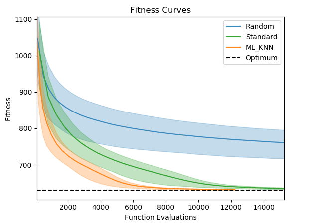
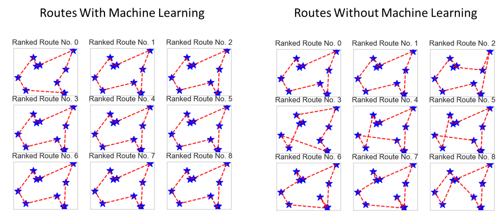

# Genetic Algorithm

A genetic algorithm solution.

Explores the benefit of machine learning classification in evolutionary loop.

## Future Work

* Plot tracked variables

## Traveling Salesman Example

A minimization problem. The algorithm seeks to find the shortest route for a traveling salesman to take through a set of cities.

### Optimization Curves

The following figure compares the optimization curves between a randomly generated population, a standard genetic algorithm, and a genetic algorithm modified to use machine learning to classify "good" children and "bad" children.

### Route Comparison

The top 10 salesman routes can be compared with and without machine learning (at 1000 objective function evaluations). The machine learning routes are notably consistent and better (shorter).

### Classifier Effectiveness

Genetic algorithms often generate many children that are worse solutions than the parent.

The classifier's job is to determine which of the children are good or better than the parents, and which are worse. The genetic algorithm can then simply discard the "bad" children and not waste computation time evaluating their fitness.

The machine learning classifier in this experiment must be evaluated on it's effectiveness and accuracy. If it ends up classifying many actually good children as bad, then the genetic algorithm will not see those children and suffer for it. if it ends up classifying many actually bad children as good, that is more acceptable as it will not worsen the actual solution results, but it will mean that we are losing efficiency and spending needless time on objective function evaluations.
